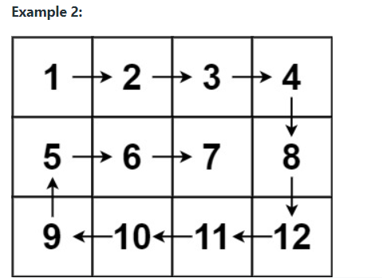
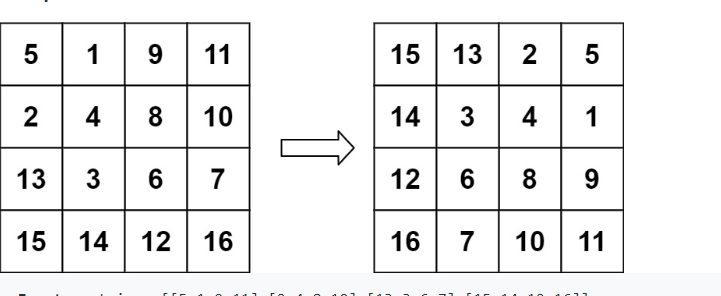

1. **2 d arrays:**
[WavePrint Problem](https://www.codingninjas.com/codestudio/problems/print-like-a-wave_893268?utm_source=youtube&utm_medium=affiliate&utm_campaign=love_babbar_6)
[Solution](https://github.com/TiyashaP/DSA/blob/main/twodarray/WavePrint.java)
Approach: In this pblm every even column is printed from top to bottom(i.e. minRow to maxrow)
and every odd row is printed from bottom to top.

[Spiral Matrix](https://leetcode.com/problems/spiral-matrix/)
[Solution](https://github.com/TiyashaP/DSA/blob/main/twodarray/SpiralMatrix.java)

Approach: Steps:
We create a list equal to the size of the 2d array
We initialise startRow,startColumn,endRow,endColumn
Till we achieve desired count we repeat following steps
Add/print the start row,update start row after print/add,update count
Add/print the endColumn,update endColumn after print/add,update count
Add/print the endRow ,update endRow after print/add,update count
Add/print the startColumn,update startColumn after print/add,update count

[Inplace rotate a matrix by 90 degree anticlockwise](https://www.codingninjas.com/codestudio/problems/inplace-rotate-matrix-90-degree_839734?leftPanelTab=0)
[Solution](https://github.com/TiyashaP/DSA/blob/main/twodarray/RotateAMatrixAntiClockWise.java)

[Rotation 90 degree anticlockwise](https://leetcode.com/problems/rotate-image/)
[Solution](https://github.com/TiyashaP/DSA/blob/main/twodarray/RotateAMatrix.java)

Approach:
Pick a random element from top row like 9
Try to find how is it placed wrt offset, here offset is 2
when we have already traversed a particular row with all offsets,reduce that particular
row or column

[search-in-a-row-wise-and-column-wise-sorted-matrix](https://www.codingninjas.com/codestudio/problems/search-in-a-row-wise-and-column-wise-sorted-matrix_839811)
Approach : Start searching from right top,
to the left there are smaller elements,to the bottom there are bigger elements.
[Solution](https://github.com/TiyashaP/DSA/blob/main/twodarray/SearchInARowAndColumnWiseSorted.java)

[Set matrix rows to zero](https://leetcode.com/problems/set-matrix-zeroes/)
Approach: We need to store the row[i]=0 and column[j]=0 if matrix[i][j]=0
we can optimise the soln by updating the 0th index of row and column ,as the status of the 
Oth row and the 0th column can be maintained by the same index, we can keep another variable for row/column,Also 
use that variable to update the 0th column
[Solution ](https://github.com/TiyashaP/DSA/blob/main/twodarray/SetZeroesInMatrix.java)
